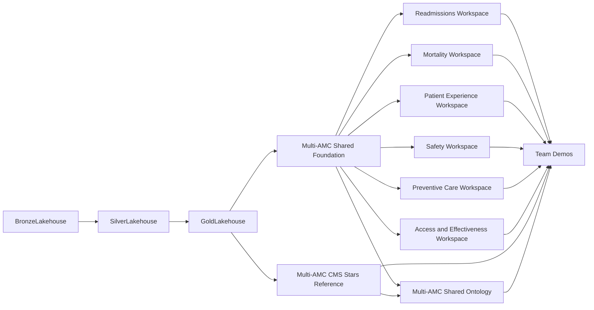

# Overall Architecture

## Objective

The architecture separates platform responsibilities from team innovation.
Every participant starts with the same governed healthcare quality data and
business definitions, while each domain team builds Fabric items in its own
workspace.

## Workspace responsibilities

| Workspace | Responsibility |
|---|---|
| AMC Data Engineering | Bronze, Silver, Gold, source ingestion, transformation, validation |
| AMC Modeling | Governed shared semantic models and base Fabric IQ ontology |
| Domain team workspaces | Team-owned models, reports, agents, notebooks, experiments, and ontology extensions |
| Shared Foundry project (optional) | One shared project and model deployment that teams can call from notebooks or agents |

## Data layers

### Bronze

Preserves raw Synthea, CMS, provider-reference, FHIR, and supplemental files.
Bronze folders separate sources and retain ingestion metadata.

### Silver

Publishes source-separated schemas:

- `synthea`
- `cms`
- `reference`
- `synthetic`

### Gold

Publishes analysis-ready schemas:

- `conformed`: shared dimensions
- `quality`: domain event facts
- `benchmark`: CMS results and benchmark distributions
- `scorecard`: facility-period star-rating scorecard and model validation

## Modeling layer

### Multi-AMC Shared Foundation

The governed Direct Lake model exposes all conformed dimensions, six domain
facts, CMS results, benchmarks, and foundational measures. It is the default
starting point for reports and team-owned semantic extensions.

### Multi-AMC CMS Stars Reference

The smaller Direct Lake model provides consistent CMS measure definitions,
facility results, benchmark distributions, published ratings, and clearly
labeled demo scores.

### MultiAMC_Shared_Ontology

The Fabric IQ ontology defines common entities and relationships. Teams extend
this vocabulary rather than redefining foundational concepts.

## Provenance rule

CMS facility-level aggregate results are authoritative public data. Synthea
patients and supplemental patient-level events are synthetic. Reports and
agents must not imply that synthetic patient events caused a real hospital's
published CMS performance.

## Portability

Data-engineering notebooks resolve lakehouses through the Variable Library.
Semantic-model and ontology definitions contain Fabric data-source bindings,
which must be rebound when deployed to a different tenant or workspace.

**Next:** [04 Lab 1: Explore the data with Copilot](04_lab1_notebook_ai.html)
